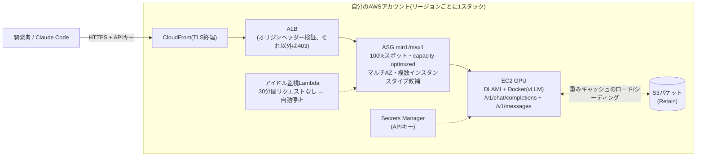

# token-forge

[English](README.md) | [한국어](README.ko.md) | **日本語**

**自分のAWSアカウント内で動くプライベートなバイブコーディングLLM。** オープンウェイトモデルを
**100%スポットインスタンス**で安価にサービングし、常時収集される**公開スポットインテリジェンス
フィード**(プレイスメントスコアの推移)により「どのリージョンでGPUスポットが確保しやすいか」を
データで判断できる。Claude Codeなどのコーディングエージェントがそのまま接続できる
OpenAI・Anthropic互換APIを提供し、プロンプト・レスポンス・利用統計はアカウントの外に出ない。

**検証済みモデルカタログ**(すべて実サービングで検証済み):

| モデル | クラス | インスタンス | 備考 |
|---|---|---|---|
| [Qwen3-Coder-30B](https://huggingface.co/Qwen/Qwen3-Coder-30B-A3B-Instruct-FP8) | 30B MoE | g6e.12xlarge(約$2.6/hスポット) | 推奨デフォルト — 月額$100-200目標の基準 |
| [GLM-4.6](https://huggingface.co/zai-org/GLM-4.6-FP8) | 355B MoE | p5.48xlarge | 大規模向けの選択肢 |
| [Solar-Open2-250B](https://huggingface.co/upstage/Solar-Open2-250B) | 250B MoE | p5.48xlarge / g6e.48xlarge | 専用vLLMフォークが必要 |

> プロダクト方針: [PR/FAQ](docs/prfaq.md)(韓国語) ・ 要件: [v1要件定義](docs/superpowers/specs/2026-08-22-token-forge-v1-requirements.md)(韓国語) ・ 初期設計: [2026-07-23設計ドキュメント](docs/superpowers/specs/2026-07-23-token-forge-design.md)(韓国語)

## なぜtoken-forgeなのか

3つの軸が核心であり、すべて実デプロイでの実測に裏付けられている — 根拠と数値は
**[コスト・セキュリティ・利便性の詳細](docs/value-proposition.md)**(韓国語)を参照。

- **コスト — 使った時間分だけ**: 100%スポット(オンデマンドの約3分の1から4分の1) +
  30分アイドルでの自動停止 + 各失敗経路でGPUを0に戻すコストガード + 重みは低コストの
  CPUスポットで事前シーディング(実測8分/$0.03)。30Bクラスで**月$100-200**、使わない月は
  GPU料金0。
- **セキュリティ — 持ち出さないことがアーキテクチャ**: 推論・プロンプト・利用統計はすべて
  自分のアカウント内で完結し、テレメトリなし(外部通信はHFダウンロード・AWS API・フィードへの
  匿名GETの3種類のみ — フィードすら自前の収集器に置き換え可能)。通信はCloudFront TLSが
  デフォルトで、ALBへの迂回アクセスは403、送信元IPアローリスト(`-c allowedCidrs=`)と
  `tkf rotate-key`によるキーローテーションを提供。すべてOSSなので自分で監査できる。
- **利便性 — リージョンを意識しなくてよい**: `tkf up` + `tkf connect claude` の2コマンドだけ。
  プレイスメントスコアの48時間推移・RTT・価格・クォータからリージョンを自動選定し、候補群に
  並行して確保を試み、最初に確保できたリージョンだけを残す(First-Acquired-Wins)。
  Anthropicの`/v1/messages`ネイティブ対応 + プレフィックスキャッシング(TTFT実測0.82秒 →
  0.14秒)により、Claude Codeがそのまま接続できる。

## 誰が使うべきか

一文で言えば: **コードを外部に送れない、トークンを大量に消費する、あるいはGPUを集中的に
使う**開発者。

**適しているケース:**

1. **プライバシー制約のある開発者** — 会社の規定や規制で外部LLM APIにコードを送れない
   場合。推論・プロンプト・使用量統計まで自分のAWSアカウント内で完結し、全体がOSSなので
   監査可能。このグループにとって代替手段は商用APIではなく「何もない」である。
2. **利用上限に縛られたヘビーパワーユーザー** — エージェントのファンアウトで1日100M+
   トークンを消費する場合。時間定額(月約$100-200)はトークン無制限であり、この規模から
   同一モデルAPIと同等、商用ファーストパーティAPI比では数倍安くなる。128Kコンテキストの
   定額利用もティア課金APIに対する構造的な利点。
3. **バッチワークロード運用者** — 夜間の大量コード分析・生成のようにGPUを埋めて使う
   場合。稼働率が上がるとトークン単価が3-5倍改善する、スポットの最適ポイント。
4. **AWSクレジット・コミット(EDP)保有組織** — API費用は別枠の支出だが、GPUスポットは
   既存のAWSコミットメント内で消化できる。

**適していないケース:**

- **ライトユーザー** — 月数十Mトークン以下なら、同じオープンウェイトモデルを提供する
  サードパーティAPIの方が圧倒的に安い。この領域でtoken-forgeを選ぶ理由はプライバシー
  だけである。
- **無停止が必要なサービス** — スポット回収時に数分の再確保ギャップを許容する設計(R3)
  のため、SLAのあるプロダクションサービングには不向き。
- **最上位モデルの品質が必須なワークロード** — オープンウェイト30B-355B級で不十分なら
  適さない。
- AWSアカウント・クォータ管理自体が負担な場合 — 初回利用にスポットクォータの引き上げ
  申請が必要。

## アーキテクチャ



モデル・インスタンスの組み合わせは`models/<model>.yaml`のプロファイルで選択する。
メインラインのvLLMがデフォルトで、専用フォークが必要なモデル(例: Solar Open2)のみ
yamlでイメージを切り替える。プレフィックスキャッシングがデフォルトで有効なため、
バイブコーディングの繰り返しコンテキストに有利。

> 内部構造・起動シーケンス・収集器まで含めた詳細ガイド:
> **[アーキテクチャドキュメント](docs/architecture.md)**(韓国語、図解中心、新規参加者向け)

## スポットインテリジェンス公開ダッシュボード・データフィード

robocoが常時運用している**GPUスポット確保可能性(プレイスメントスコア) x 価格の公開サービス**:

- **ダッシュボード**: https://d16jdvzof4zpo7.cloudfront.net — p5・g6eの主要タイプの
  リージョン/AZ別プレイスメントスコア推移、スポット価格、曜日×時間帯ヒートマップ、
  コストパフォーマンスランキング(1時間おきに更新、90日分の履歴)
- **データフィード**: https://d16jdvzof4zpo7.cloudfront.net/data.json — CORS全面許可。
  スキーマ・利用方法は[docs/spot-feed.md](docs/spot-feed.md)(韓国語)

同じ収集器を自分のアカウントに直接立てるには`cdk deploy -c collector=1`(常時稼働の別スタック)。

## 前提条件

- **スポットvCPUクォータ** — ほとんどのアカウントでデフォルト0。30Bクラス(g6e.12xlarge)は
  **48**、48xlargeクラスの大規模モデルは**192**が必要。Service Quotasでp5は
  "All P Spot Instance Requests"(L-7212CCBC)、g6eは"All G and VT Spot Instance
  Requests"(L-3819A6DF)の引き上げを申請する。新規アカウントは部分承認になりがちなので、
  **[EC2クォータ引き上げ申請ガイド](docs/ec2-quota-guide.md)**(韓国語)のアピール文の
  書き方を参考にすること。
- コスト目安(スポット、リージョン・時期により変動): g6e.12xlargeが約**$2.6/hr**、
  g6e.48xlargeが約**$10-13/hr**、p5.48xlargeが約**$30-50/hr**。アイドル自動停止が
  デフォルトで有効だが、長期間使わない場合は`cdk destroy`を推奨。
- Node 20以上、ブートストラップ済みアカウント(`cdk bootstrap`)。AWS CDK CLIは
  パッケージの依存関係に含まれているため個別インストールは不要(ソースから
  インストールする場合のみ別途必要)。

## tkf CLI(推奨インターフェース)

cdkのコンテキストとscripts/*.shを直接扱う代わりに、統合CLIを使うことができる:

```bash
npm install -g @roboco/token-forge   # tkfコマンドをインストール
# もしくはソースからインストール:
# npm install && npm run build && npm link
tkf model list                              # 検証済みモデルカタログ
tkf placement qwen3-coder-30b               # リージョン推奨テーブル(48hプレイスメントスコア・RTT・価格・クォータ)
tkf seed qwen3-coder-30b                    # 重みのS3事前シーディングのみ(GPU 0台、リージョン選択プロンプト)
tkf up qwen3-coder-30b                      # リージョン自動選定 + 並行レース起動(R10)
tkf up qwen3-coder-30b --region ap-northeast-2   # リージョンを直接指定
tkf status                                  # ステータス確認
tkf connect claude                          # Claude Code接続(source ~/.token-forge/env.sh)
tkf down                                    # GPU停止(--purge: 完全削除、--region: 対象指定)
tkf rotate-key                             # APIキーローテーション(稼働中なら再起動時に反映)
tkf config set standby single               # スタンバイポリシー: race(デフォルト、K=2) | single | lazy
```

`--region`を省略すると、プレイスメントエンジンが公開フィードの48時間プレイスメントスコア
平均、EC2エンドポイントのRTT(24hキャッシュ)、スポット価格、アカウントクォータを総合して
候補リージョンを序列化し(安定性 → レイテンシ → 価格の順)、上位K個のリージョンに同時に
スポットをリクエストして最初に確保できたリージョンだけを残す(First-Acquired-Wins)。
フィードが対象タイプをカバーしていない場合はリアルタイムのプレイスメントスコアに自動
フォールバックする。

初回の`up`は事前シーディングを含めて約20分、以降はキャッシュブートで約8分(スポットが
即座に割り当てられる場合)。プライバシーモードでは`tkf config set feedUrl
<自前収集器のURL>`により、フィードの参照すら自分のアカウント内で完結させられる。

## デプロイ

```bash
npm install
cdk deploy -c model=solar-open2-250b -c profile=int4-g6e -c region=ap-northeast-1
# プロファイル: int4(p5) / int4-g6e(g6e、低コスト) / bf16(p5)
# オプション: -c azs=... -c minCapacity=0 -c idleMinutes=60 -c alertEmail=you@example.com
#            -c allowedCidrs=203.0.113.0/24  (送信元IPアローリスト — それ以外はすべて403)
```

どのリージョン・時間帯でスポットが確保しやすいかは、上記の**公開ダッシュボード**を先に
確認すると失敗リトライのループを大幅に減らせる。

既存のデプロイをこのバージョンに更新するとEndpointUrlがhttpsに変わるため、
`tkf connect claude`を再実行する必要がある。

初回起動はHFダウンロード + S3シーディングのため時間がかかる(INT4で約150GB)。
以降の再プロビジョニングはS3キャッシュからのs5cmdロードで短縮される(目標約15分)。

### 新規モデルのオンボーディング — 重みの事前シーディングを推奨(GPUコスト節約)

初回ダウンロードをGPUインスタンス上で行うと、ダウンロード時間分だけGPU料金が発生する
(実測: GLM-4.6の337GBが約50分 × p5スポット$22/h ≈ $18)。低コストのCPUスポットで
先にシーディングしておこう:

```bash
cdk deploy -c model=<m> -c profile=<p> -c region=<r> -c minCapacity=0  # スタックのみ作成、GPU 0台
scripts/seed-weights.sh <stack-name> <region>   # c6idスポット(約$0.2/h)がHF→S3シーディング後に自動終了
scripts/start.sh <stack-name> <region>          # GPUはS3キャッシュから約15分以内にサービス開始
```

## 使い方

```bash
API_KEY=$(aws secretsmanager get-secret-value \
  --secret-id <ApiKeySecretArn出力値> --query SecretString --output text)
scripts/smoke-test.sh <EndpointUrl出力値> "${API_KEY}"
```

OpenAI SDK: `base_url="<EndpointUrl>/v1"`, `api_key=${API_KEY}`。

## 新規モデルの追加

`models/<model-name>.yaml`を1つ追加 → `cdk deploy -c model=<model-name> -c profile=<profile>`。
スキーマは`models/solar-open2-250b.yaml`を参照(`vllmImage`、
`profiles.<name>.{weightsRepo,instanceType,vllmFlags,maxModelLen}`)。

## トラブルシューティング

| 症状 | 確認事項 |
|---|---|
| 30分以上InServiceが0のまま(SNSアラーム) | スポットクォータ/キャパシティ不足。Service Quotas・公開ダッシュボードで別リージョンを検討 |
| g6eでvLLMがCUDAグラフキャプチャ中にクラッシュ | INT4 MoE + TP=8では`--enable-expert-parallel`が必須(`int4-g6e`プロファイルに含まれている) |
| インスタンスが繰り返し置き換わる | SSMセッションで接続 → `cat /var/log/token-forge-boot.log`、`docker logs vllm`(OOMなど)を確認。vLLMコンテナのログはCloudWatch Logsのロググループ`/token-forge/vllm`でも確認可能(インスタンス終了後も保存される) |
| スポット中断通知を受信 | 正常 — ASGが自動的に再プロビジョニングする。S3キャッシュから約15分以内に復旧 |
| HFダウンロードが3回失敗 | ログを確認した上でインスタンスを終了(ASGが置き換え)するか、ネットワークを点検 |

## コスト削減(実験用運用)

- **アイドル自動シャットダウン(デフォルトで有効)**: ALBへのリクエストが30分間なければ、
  インスタンスを自動的に0台に減らしSNSで通知する。間隔変更は`-c idleMinutes=60`、
  無効化は`-c idleMinutes=0`。
- **手動オン/オフ**:
  ```bash
  scripts/stop.sh  <stack-name> <region>   # GPUコスト停止(ALB/S3のみ維持、約$16/月)
  scripts/start.sh <stack-name> <region>   # 再起動 — S3キャッシュにより数分から15分以内にサービス復帰
  ```
- **長期未使用時**: `cdk destroy`を推奨。S3の重みキャッシュはRetainで残るため、
  再デプロイ時も高速起動できる。

## スコープ(YAGNI)

オートスケーリングなし(min1/max1)、Web UIなし。エンドポイントはCloudFront経由のHTTPSが
デフォルトで(独自ドメイン不要)、ALBへの直接アクセスはオリジン検証ヘッダーがないため
403になる。送信元IPアローリストは`-c allowedCidrs=`で有効化する。非ストリーミング
リクエストはCloudFrontのレスポンス待機上限(60秒)の対象となるため、長時間の生成には
ストリーミング(stream)を使用すること。

## プロジェクトの方向性

目標は**現在・将来のオープンウェイトLLMをスポットで安価に、かつ安定して使える
プライベートLLMプラットフォーム**である。
[v1要件(R1-R11)](docs/superpowers/specs/2026-08-22-token-forge-v1-requirements.md)
(韓国語)が確定し、段階的に実装が進んでいる:

- **統合CLI**(`tkf up/down/status/model/connect`) — フェーズ1完了、上記のtkf CLIの節を参照
- **インテリジェントプレイスメント(R10)** — プレイスメントスコア推移・レイテンシ・価格・
  クォータから最適なリージョンを自動選定し、候補リージョンに並行して確保を試みて最初に
  確保できたリージョンだけを残すレース(First-Acquired-Wins) — フェーズ2完了、
  上記のtkf CLIの節を参照
- **バイブコーディングのファーストクラスサポート** — Anthropic互換API(`/v1/messages`)、
  プレフィックスキャッシング、Claude Codeのツール呼び出しまで実デプロイで検証済み
- **通信セキュリティ(R11)** — TLS終端、APIキーローテーション、送信元IPアローリスト

自分で運用したくない場合(マネージド形態に興味がある場合)は、ぜひissueで意見を残してほしい。
実際のユースケースがロードマップを決める。
