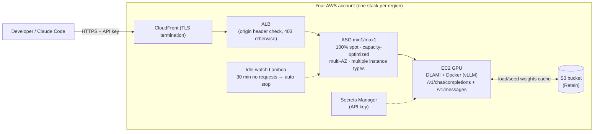

# token-forge

**English** | [한국어](README.ko.md) | [日本語](README.ja.md)

**A private vibe-coding LLM that runs inside your own AWS account.** It serves open-weight
models cheaply on **100% spot instances**, and a continuously-running **public spot
intelligence feed** (placement-score trends) turns "which region has GPU spot capacity
right now" into a data-driven answer. It exposes an OpenAI/Anthropic-compatible API that
coding agents like Claude Code can plug into directly, and your prompts, responses, and
usage stats never leave your account.

**Verified model catalog** (all validated against real serving deployments):

| Model | Class | Instance | Notes |
|---|---|---|---|
| [Qwen3-Coder-30B](https://huggingface.co/Qwen/Qwen3-Coder-30B-A3B-Instruct-FP8) | 30B MoE | g6e.12xlarge (about $2.6/h spot) | Recommended default — baseline for the $100-200/month target |
| [GLM-4.6](https://huggingface.co/zai-org/GLM-4.6-FP8) | 355B MoE | p5.48xlarge | Large-scale option |
| [Solar-Open2-250B](https://huggingface.co/upstage/Solar-Open2-250B) | 250B MoE | p5.48xlarge / g6e.48xlarge | Requires a dedicated vLLM fork |

> Product direction: [PR/FAQ](docs/prfaq.md) (Korean) · Requirements: [v1 requirements](docs/superpowers/specs/2026-08-22-token-forge-v1-requirements.md) (Korean) · Original design: [2026-07-23 design doc](docs/superpowers/specs/2026-07-23-token-forge-design.md) (Korean)

## Why token-forge

Three pillars matter here, and all three are backed by measurements from real deployments —
see **[cost, security, and convenience details](docs/value-proposition.md)** (Korean) for the
evidence and numbers.

- **Cost — pay only for the time you use**: 100% spot (roughly a quarter to a third of
  on-demand pricing) + automatic shutdown after 30 minutes idle + a cost guard that resets
  GPU capacity to zero on every failure path + weights pre-seeded via cheap CPU spot
  instances (measured at 8 minutes / $0.03). About **$100-200/month** for a 30B-class
  model, and $0 in GPU charges during months you don't use it.
- **Security — no-exfiltration by architecture**: inference, prompts, and usage stats stay
  entirely inside your account, with no telemetry (the only outbound traffic is HF
  downloads, AWS API calls, and anonymous GET requests to the feed — and even the feed can
  be replaced with your own self-hosted collector). Transport defaults to CloudFront TLS,
  direct ALB access returns 403, and you get a source-IP allowlist (`-c allowedCidrs=`) plus
  key rotation via `tkf rotate-key`. Everything is open source, so you can audit it yourself.
- **Convenience — you don't need to know the region**: just two commands, `tkf up` and
  `tkf connect claude`. Region selection is automated from 48-hour placement-score trends,
  RTT, pricing, and quota, and the tool races capacity acquisition across candidate regions
  in parallel, keeping only whichever region wins first (First-Acquired-Wins). Native
  Anthropic `/v1/messages` support plus prefix caching (measured TTFT dropping from 0.82s to
  0.14s) means Claude Code connects without any adjustment.

## Architecture



The model/instance combination is selected through a profile in `models/<model>.yaml`.
Mainline vLLM is the default; only models that need a dedicated fork (e.g., Solar Open2)
override the image in their yaml. Prefix caching is on by default, which favors the
repeated-context patterns typical of vibe coding.

> For internal architecture, boot sequence, and the collector, see the detailed guide:
> **[architecture docs](docs/architecture.md)** (Korean, diagram-heavy, aimed at new
> contributors)

## Public spot intelligence dashboard and data feed

roboco runs an always-on **GPU spot availability (placement score) x pricing public
service**:

- **Dashboard**: https://d16jdvzof4zpo7.cloudfront.net — placement-score trends by
  region/AZ for the major p5 and g6e instance types, spot pricing, a day-of-week x
  hour-of-day heatmap, and a value-for-money ranking (refreshed hourly, 90-day history)
- **Data feed**: https://d16jdvzof4zpo7.cloudfront.net/data.json — fully CORS-enabled.
  Schema and usage details in [docs/spot-feed.md](docs/spot-feed.md) (Korean)

To run the same collector directly in your own account, use
`cdk deploy -c collector=1` (a separate, always-on stack).

## Prerequisites

- **Spot vCPU quota** — most accounts start at 0. A 30B-class model (g6e.12xlarge) needs
  **48**, and 48xlarge-class large models need **192**. In Service Quotas, request an
  increase for "All P Spot Instance Requests" (L-7212CCBC) for p5, or "All G and VT Spot
  Instance Requests" (L-3819A6DF) for g6e. New accounts are often only partially approved
  — see the **[EC2 quota increase request guide](docs/ec2-quota-guide.md)** (Korean) for
  how to write an effective appeal.
- Cost reference (spot pricing, varies by region and time): about **$2.6/hr** for
  g6e.12xlarge, about **$10-13/hr** for g6e.48xlarge, and about **$30-50/hr** for
  p5.48xlarge. Idle auto-shutdown is on by default, but `cdk destroy` is recommended for
  extended periods of non-use.
- Node 20+, and a bootstrapped account (`cdk bootstrap`). The AWS CDK CLI is bundled as a
  package dependency, so you don't need to install it separately (only required as a
  separate install if you're installing from source).

## tkf CLI (recommended interface)

Instead of working with cdk context flags and scripts/*.sh directly, you can use the
unified CLI:

```bash
npm install -g @serithemage/tkf   # install the tkf command
# or, to install from source:
# npm install && npm run build && npm link
tkf model list                              # verified model catalog
tkf placement qwen3-coder-30b               # region recommendation table (48h placement score, RTT, price, quota)
tkf seed qwen3-coder-30b                    # pre-seed weights to S3 only (0 GPUs, prompts for a region)
tkf up qwen3-coder-30b                      # auto region selection + parallel race launch (R10)
tkf up qwen3-coder-30b --region ap-northeast-2   # specify a region directly
tkf status                                  # check current status
tkf connect claude                          # connect Claude Code (source ~/.token-forge/env.sh)
tkf down                                    # stop GPUs (--purge: full teardown, --region: target a specific region)
tkf rotate-key                             # rotate the API key (applied on next restart if already running)
tkf config set standby single               # standby policy: race (default, K=2) | single | lazy
```

If you omit `--region`, the placement engine ranks candidate regions by combining the
public feed's 48-hour placement-score average, EC2 endpoint RTT (24h cache), spot pricing,
and account quota (in priority order: stability -> latency -> price), then requests spot
capacity simultaneously across the top K regions and keeps only whichever region acquires
capacity first (First-Acquired-Wins). If the feed doesn't cover the target instance type, it
falls back automatically to real-time placement scoring.

The first `up` takes about 20 minutes including pre-seeding; subsequent runs boot from
cache in about 8 minutes (assuming spot capacity is granted immediately). In privacy mode,
`tkf config set feedUrl <your-collector-URL>` lets you resolve even feed lookups entirely
within your own account.

## Deployment

```bash
npm install
cdk deploy -c model=solar-open2-250b -c profile=int4-g6e -c region=ap-northeast-1
# profiles: int4 (p5) / int4-g6e (g6e, lower cost) / bf16 (p5)
# options: -c azs=... -c minCapacity=0 -c idleMinutes=60 -c alertEmail=you@example.com
#          -c allowedCidrs=203.0.113.0/24  (source-IP allowlist — everything else gets 403)
```

Checking the **public dashboard** above first for which region and time of day has good
spot availability can significantly cut down on failed retry loops.

Updating an existing deployment to this version changes EndpointUrl to https, so you'll
need to re-run `tkf connect claude`.

The first boot takes a while due to the HF download plus S3 seeding (about 150GB for
INT4). Subsequent reprovisioning is much faster since it loads from the S3 cache via
s5cmd (targeting about 15 minutes).

### Onboarding a new model — pre-seeding weights is recommended (saves GPU cost)

If the first download happens on a GPU instance, you pay GPU rates for the entire
download (measured: GLM-4.6 at 337GB took about 50 minutes on a p5 spot instance at
$22/h, roughly $18). Seed with a cheap CPU spot instance first instead:

```bash
cdk deploy -c model=<m> -c profile=<p> -c region=<r> -c minCapacity=0  # create the stack only, 0 GPUs
scripts/seed-weights.sh <stack-name> <region>   # a c6id spot instance (about $0.2/h) seeds HF -> S3, then terminates itself
scripts/start.sh <stack-name> <region>          # GPU comes up from the S3 cache in about 15 minutes
```

## Usage

```bash
API_KEY=$(aws secretsmanager get-secret-value \
  --secret-id <ApiKeySecretArn output> --query SecretString --output text)
scripts/smoke-test.sh <EndpointUrl output> "${API_KEY}"
```

OpenAI SDK: `base_url="<EndpointUrl>/v1"`, `api_key=${API_KEY}`.

## Adding a new model

Add a single `models/<model-name>.yaml` file, then run
`cdk deploy -c model=<model-name> -c profile=<profile>`.
See `models/solar-open2-250b.yaml` for the schema (`vllmImage`,
`profiles.<name>.{weightsRepo,instanceType,vllmFlags,maxModelLen}`).

## Troubleshooting

| Symptom | What to check |
|---|---|
| InService stays at 0 for more than 30 minutes (SNS alarm) | Spot quota or capacity shortage. Check Service Quotas and the public dashboard, and consider a different region |
| vLLM crashes during CUDA graph capture on g6e | INT4 MoE with TP=8 requires `--enable-expert-parallel` (already included in the `int4-g6e` profile) |
| Instance keeps getting replaced | Connect via SSM Session Manager and check `cat /var/log/token-forge-boot.log` and `docker logs vllm` (e.g., for OOM). vLLM container logs are also available in the CloudWatch Logs group `/token-forge/vllm` (retained even after the instance terminates) |
| Received a spot interruption notice | Normal — the ASG reprovisions automatically. Recovers from the S3 cache in about 15 minutes |
| HF download failed 3 times | Check the logs, then either terminate the instance (triggering an ASG replacement) or investigate network issues |

## Cost reduction (for experimental use)

- **Idle auto-shutdown (on by default)**: if the ALB sees no requests for 30 minutes,
  instances are automatically scaled down to 0 and an SNS notification is sent.
  Change the interval with `-c idleMinutes=60`, or disable with `-c idleMinutes=0`.
- **Manual on/off**:
  ```bash
  scripts/stop.sh  <stack-name> <region>   # stop GPU billing (keeps ALB/S3, about $16/month)
  scripts/start.sh <stack-name> <region>   # restart — back in service within minutes to 15 minutes via the S3 cache
  ```
- **Extended non-use**: `cdk destroy` is recommended. The S3 weights cache is retained
  (Retain policy), so a future redeploy still boots quickly.

## Scope (YAGNI)

No autoscaling (min1/max1), no web UI. The endpoint defaults to HTTPS via CloudFront (no
domain required), and direct ALB access returns 403 since it lacks the origin
verification header. A source-IP allowlist can be enabled with `-c allowedCidrs=`.
Non-streaming requests are subject to CloudFront's response wait cap (60 seconds), so use
streaming for long-running generations.

## Project direction

The goal is a **private LLM platform that lets you run current and future open-weight LLMs
cheaply on spot instances, while still being reliable**. The
[v1 requirements (R1-R11)](docs/superpowers/specs/2026-08-22-token-forge-v1-requirements.md)
(Korean) are finalized and being implemented in stages:

- **Unified CLI** (`tkf up/down/status/model/connect`) — phase 1 complete, see the tkf CLI
  section above
- **Intelligent placement (R10)** — automatically selects the best region from
  placement-score trends, latency, price, and quota, then races capacity acquisition
  across candidate regions and keeps only whichever wins first (First-Acquired-Wins) —
  phase 2 complete, see the tkf CLI section above
- **First-class vibe-coding support** — Anthropic-compatible API (`/v1/messages`), prefix
  caching, and Claude Code tool-calling, all verified against real deployments
- **Transport security (R11)** — TLS termination, API key rotation, source-IP allowlist

If you'd rather not operate this yourself and would be interested in a managed offering,
please leave your thoughts as an issue. Real use cases will shape the roadmap.
