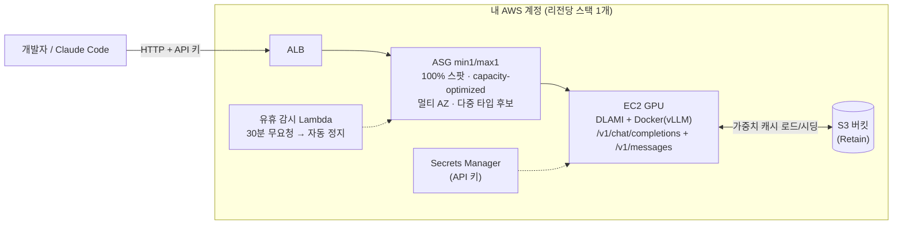

# token-forge

**내 AWS 계정 안에서 도는 프라이빗 바이브 코딩 LLM.** 오픈 웨이트 모델을 **100% 스팟
인스턴스**로 값싸게 서빙하고, 상시 수집되는 **공개 스팟 인텔리전스 피드**(배치점수 추이)로
"어느 리전에서 GPU 스팟이 잡히는가"를 데이터로 푼다. Claude Code 등 코딩 에이전트가
바로 붙는 OpenAI·Anthropic 호환 API를 제공하며, 프롬프트·응답·사용량 통계는 계정 밖으로
나가지 않는다.

**검증된 모델 카탈로그** (전부 실서빙 검증):

| 모델 | 급 | 인스턴스 | 비고 |
|---|---|---|---|
| [Qwen3-Coder-30B](https://huggingface.co/Qwen/Qwen3-Coder-30B-A3B-Instruct-FP8) | 30B MoE | g6e.12xlarge (약 $2.6/h 스팟) | 권장 기본 — 월 $100-200 목표의 기준 |
| [GLM-4.6](https://huggingface.co/zai-org/GLM-4.6-FP8) | 355B MoE | p5.48xlarge | 대형 선택지 |
| [Solar-Open2-250B](https://huggingface.co/upstage/Solar-Open2-250B) | 250B MoE | p5.48xlarge / g6e.48xlarge | 전용 vLLM 포크 사용 |

> 제품 방향: [PR/FAQ](docs/prfaq.md) · 요건: [v1 요건 정의](docs/superpowers/specs/2026-08-22-token-forge-v1-requirements.md) · 초기 설계: [2026-07-23 설계 문서](docs/superpowers/specs/2026-07-23-token-forge-design.md)

## 아키텍처



모델·인스턴스 조합은 `models/<model>.yaml`의 프로파일로 선택한다. 메인라인 vLLM이
기본이고, 전용 포크가 필요한 모델(예: Solar Open2)만 yaml에서 이미지를 바꾼다.
prefix caching이 기본이라 바이브 코딩의 반복 컨텍스트에 유리하다.

> 내부 구조·부팅 시퀀스·수집기까지 포함한 상세 안내:
> **[아키텍처 문서](docs/architecture.md)** (신규 참가자용, 다이어그램 중심)

## 스팟 인텔리전스 공개 대시보드·데이터 피드

roboco가 상시 운영하는 **GPU 스팟 확보 가능성(배치점수) × 가격 공개 서비스**:

- **대시보드**: https://d16jdvzof4zpo7.cloudfront.net — p5·g6e 주요 타입의 리전/AZ별
  배치점수 추이, 스팟 가격, 요일×시간 히트맵, 가성비 랭킹 (1시간 주기 갱신, 90일 이력)
- **데이터 피드**: https://d16jdvzof4zpo7.cloudfront.net/data.json — CORS 전면 허용.
  스키마·이용법은 [docs/spot-feed.md](docs/spot-feed.md)

같은 수집기를 자기 계정에 직접 띄우려면 `cdk deploy -c collector=1` (별도 상시 스택).

## 사전 조건

- **스팟 vCPU 쿼터** — 대부분 계정 기본 0. 30B급(g6e.12xlarge)은 **48개**, 48xlarge
  대형 모델은 **192개** 필요. Service Quotas에서 p5는 "All P Spot Instance
  Requests"(L-7212CCBC), g6e는 "All G and VT Spot Instance Requests"(L-3819A6DF) 상향
  신청. 신규 계정은 부분 승인이 흔하므로 **[EC2 쿼터 증설 요청 가이드](docs/ec2-quota-guide.md)**
  의 어필 문안 작성법 참고.
- 비용 참고 (스팟, 리전·시점 변동): g6e.12xlarge 약 **$2.6/hr**, g6e.48xlarge 약
  **$10-13/hr**, p5.48xlarge 약 **$30-50/hr**. 유휴 자동 정지가 기본이지만 장기
  미사용 시 `cdk destroy` 권장.
- Node 20+, AWS CDK CLI (`npm i -g aws-cdk`), 부트스트랩된 계정(`cdk bootstrap`).

## tkf CLI (권장 인터페이스)

cdk 컨텍스트와 scripts/*.sh를 직접 다루는 대신 통합 CLI를 쓸 수 있다:

```bash
npm install && npm run build && npm link   # tkf 명령 설치
tkf model list                              # 검증된 모델 카탈로그
tkf placement qwen3-coder-30b               # 리전 추천 표 (배치점수 48h·RTT·가격·쿼터)
tkf seed qwen3-coder-30b                    # 가중치 S3 선시딩만 (GPU 0대, 리전 선택 프롬프트)
tkf up qwen3-coder-30b                      # 리전 자동 선정 + 병렬 레이스 기동 (R10)
tkf up qwen3-coder-30b --region ap-northeast-2   # 리전 직접 지정
tkf status                                  # 상태 확인
tkf connect claude                          # Claude Code 연결 (source ~/.token-forge/env.sh)
tkf down                                    # GPU 정지 (--purge: 완전 삭제, --region: 대상 지정)
tkf rotate-key                             # API 키 회전 (가동 중이면 재기동 시 적용)
tkf config set standby single               # 스탠바이 정책: race(기본, K=2) | single | lazy
```

`--region`을 생략하면 배치 엔진이 공개 피드의 48시간 배치점수 평균, EC2 엔드포인트
RTT(24h 캐시), 스팟 가격, 계정 쿼터를 종합해 후보 리전을 서열화하고(안정성 → 레이턴시
→ 가격), 상위 K개 리전에 동시에 스팟을 요청해 먼저 확보한 리전만 남긴다(First-Acquired-
Wins). 피드가 대상 타입을 커버하지 않으면 실시간 배치점수로 자동 폴백한다.

첫 `up`은 선시딩 포함 약 20분, 이후에는 캐시 부팅으로 약 8분(스팟 즉시 배정 기준).
프라이버시 모드는 `tkf config set feedUrl <자가 수집기 URL>`로 피드 조회조차 자기 계정
안에서 해결할 수 있다.

## 배포

```bash
npm install
cdk deploy -c model=solar-open2-250b -c profile=int4-g6e -c region=ap-northeast-1
# 프로파일: int4(p5) / int4-g6e(g6e, 저비용) / bf16(p5)
# 옵션: -c azs=... -c minCapacity=0 -c idleMinutes=60 -c alertEmail=you@example.com
#       -c allowedCidrs=203.0.113.0/24  (소스 IP 허용목록 — 그 외 전부 403)
```

어느 리전·시간대에 스팟이 잘 잡히는지는 위의 **공개 대시보드**를 먼저 확인하면
실패 루프를 크게 줄일 수 있다.

첫 부팅은 HF 다운로드 + S3 시딩으로 오래 걸린다(INT4 약 150GB).
이후 재프로비저닝은 S3 캐시에서 s5cmd 로드로 단축(목표 약 15분).

### 새 모델 온보딩 — 가중치 선시딩 권장 (GPU 비용 절약)

첫 다운로드를 GPU 인스턴스에서 하면 다운로드 시간만큼 GPU 요금을 낸다
(실측: GLM-4.6 337GB ≈ 50분 × p5 스팟 $22/h ≈ $18). 저가 CPU 스팟으로 먼저 시딩하자:

```bash
cdk deploy -c model=<m> -c profile=<p> -c region=<r> -c minCapacity=0  # 스택만 생성, GPU 0대
scripts/seed-weights.sh <stack-name> <region>   # c6id 스팟(약 $0.2/h)이 HF→S3 시딩 후 자동 종료
scripts/start.sh <stack-name> <region>          # GPU는 S3 캐시로 약 15분 내 서비스
```

## 사용

```bash
API_KEY=$(aws secretsmanager get-secret-value \
  --secret-id <ApiKeySecretArn 출력값> --query SecretString --output text)
scripts/smoke-test.sh <EndpointUrl 출력값> "${API_KEY}"
```

OpenAI SDK: `base_url="<EndpointUrl>/v1"`, `api_key=${API_KEY}`.

## 새 모델 추가

`models/<model-name>.yaml` 1개 추가 → `cdk deploy -c model=<model-name> -c profile=<profile>`.
스키마는 `models/solar-open2-250b.yaml` 참고 (`vllmImage`, `profiles.<name>.{weightsRepo,instanceType,vllmFlags,maxModelLen}`).

## 트러블슈팅

| 증상 | 확인 |
|---|---|
| 30분 넘게 InService 0 (SNS 알람) | 스팟 쿼터/용량 부족. Service Quotas·공개 대시보드로 다른 리전 검토 |
| g6e에서 vLLM이 CUDA 그래프 캡처 중 크래시 | INT4 MoE + TP=8은 `--enable-expert-parallel` 필수 (`int4-g6e` 프로파일에 포함됨) |
| 인스턴스가 계속 교체됨 | SSM 세션 접속 → `cat /var/log/token-forge-boot.log`, `docker logs vllm` (OOM 등). vLLM 컨테이너 로그는 CloudWatch Logs 그룹 `/token-forge/vllm`에서도 확인 가능 (인스턴스 종료 후에도 보존) |
| 스팟 중단 알림 수신 | 정상 — ASG가 자동 재프로비저닝. S3 캐시로 약 15분 내 복구 |
| HF 다운로드 3회 실패 | 로그 확인 후 인스턴스 종료(ASG 교체) 또는 네트워크 점검 |

## 비용 절감 (실험용 운영)

- **유휴 자동 셧다운(기본 켜짐)**: ALB 요청이 30분간 없으면 인스턴스를 자동으로 0대로 내리고 SNS로 알린다.
  간격 변경 `-c idleMinutes=60`, 비활성화 `-c idleMinutes=0`.
- **수동 온/오프**:
  ```bash
  scripts/stop.sh  <stack-name> <region>   # GPU 비용 정지 (ALB/S3만 유지, 약 $16/월)
  scripts/start.sh <stack-name> <region>   # 재기동 — S3 캐시로 수 분에서 15분 내 서비스 복귀
  ```
- **장기 미사용**: `cdk destroy` 권장. S3 가중치 캐시는 Retain으로 남아 재배포 시 고속 부팅.

## 스코프 (YAGNI)

오토스케일링 없음(min1/max1), 웹 UI 없음. 엔드포인트는 CloudFront 경유 HTTPS가 기본이며
(도메인 불요), ALB 직접 접근은 오리진 검증 헤더가 없어 403이다. 소스 IP 허용목록은
`-c allowedCidrs=`로 켠다.

## 프로젝트 방향

목표는 **현존·미래의 오픈 웨이트 LLM을 스팟으로 값싸게, 그러면서도 안정적으로 쓰는
프라이빗 LLM 플랫폼**이다. [v1 요건(R1-R11)](docs/superpowers/specs/2026-08-22-token-forge-v1-requirements.md)이
확정되어 단계적으로 구현 중:

- **통합 CLI** (`tkf up/down/status/model/connect`) — 1단계 완료, 위의 tkf CLI 절 참고
- **지능형 배치(R10)** — 배치점수 추이·레이턴시·가격·쿼터로 최적 리전을 자동 선정하고,
  후보 리전들에 병렬로 확보를 시도해 먼저 잡힌 곳만 남기는 레이스(First-Acquired-Wins)
  — 2단계 완료, 위의 tkf CLI 절 참고
- **바이브 코딩 1급 지원** — Anthropic 호환 API(`/v1/messages`), prefix caching,
  Claude Code 도구 호출까지 실배포 검증 완료
- **전송 보안(R11)** — TLS 종단, API 키 회전, 소스 IP 허용목록

이런 운영을 직접 하고 싶지 않다면(매니지드 형태에 관심이 있다면) 이슈로 의견을 남겨 달라.
사용 사례가 로드맵을 결정한다.
