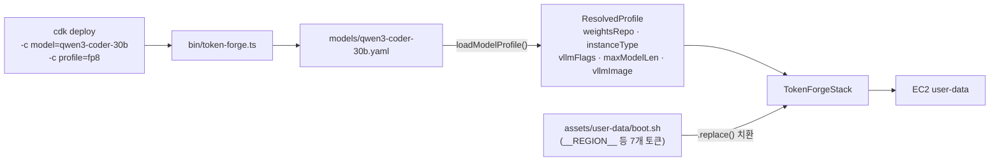
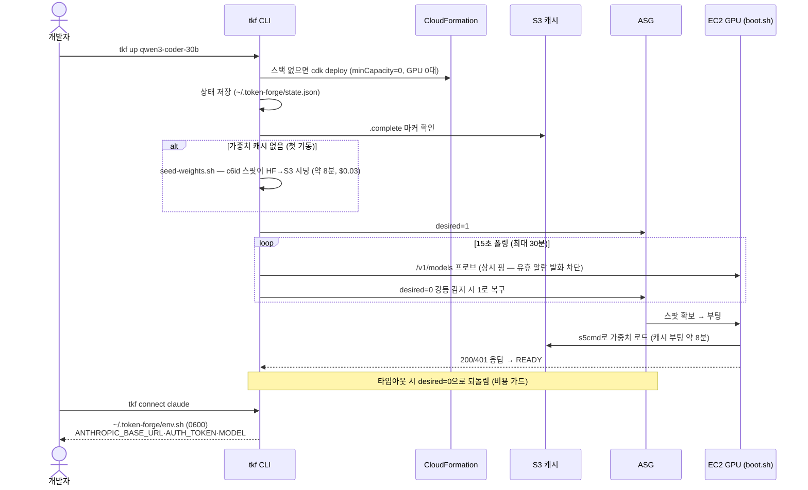
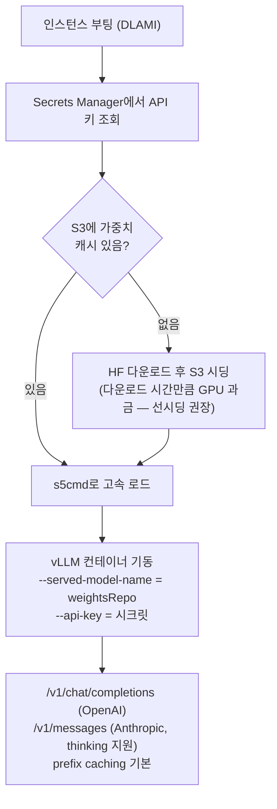
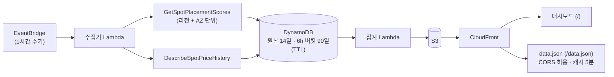
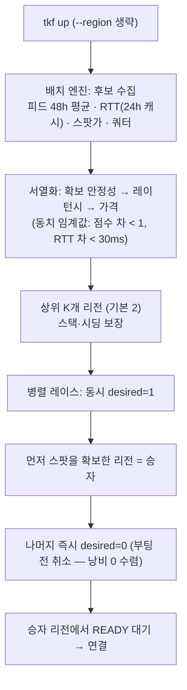

# token-forge 아키텍처 안내

> 프로젝트에 처음 참가하는 사람을 위한 문서. "무엇이 어디서 돌고, 코드가 어떻게
> 연결되는가"를 다이어그램 중심으로 설명한다. 제품이 *왜* 이렇게 생겼는지는
> [PR/FAQ](prfaq.md)와 [v1 요건 정의](superpowers/specs/2026-08-22-token-forge-v1-requirements.md)를 먼저 읽으면 좋다.

## 1. 한 문장 요약

**token-forge는 사용자의 AWS 계정 안에 오픈 웨이트 LLM을 100% 스팟 인스턴스로
띄우고, Claude Code 같은 코딩 에이전트를 바로 연결해 주는 셀프서브 CLI + CDK 스택**이다.
roboco는 서버를 운영하지 않는다 — 유일한 외부 서비스는 "어느 리전에서 스팟이
잡히는가"를 알려주는 공개 배치점수 피드(읽기 전용)뿐이다.

## 2. 큰 그림 — 무엇이 어디서 도는가

```mermaid
flowchart TB
    subgraph LOCAL["개발자 로컬"]
        CC["Claude Code / OpenAI 호환 도구"]
        TF["tkf CLI  (cli/)"]
    end

    subgraph USER["사용자 AWS 계정  ← 추론·데이터는 전부 여기"]
        ALB["ALB (HTTP + API 키)"]
        ASG["ASG min1/max1<br/>100% 스팟 · capacity-optimized<br/>멀티 AZ · 다중 인스턴스 타입"]
        EC2["EC2 GPU 인스턴스<br/>DLAMI + Docker(vLLM)"]
        S3[("S3 가중치 캐시<br/>(Retain)")]
        SM["Secrets Manager<br/>(API 키)"]
        IDLE["유휴 감시 Lambda<br/>30분 무요청 → desired 0"]
    end

    subgraph ROBOCO["roboco 계정 (공개 서비스)"]
        COL["수집기 Lambda (1시간 주기)<br/>GetSpotPlacementScores + 스팟 가격"]
        DDB[("DynamoDB<br/>TTL 90일")]
        CDN["CloudFront<br/>대시보드 + data.json"]
    end

    HF["Hugging Face<br/>(가중치 다운로드)"]

    CC -- "ANTHROPIC_BASE_URL<br/>= 스택 엔드포인트" --> ALB
    TF -- "AWS API<br/>(CFN·ASG·EC2·S3·Secrets)" --> USER
    TF -. "익명 GET (선택)<br/>배치점수 추이" .-> CDN
    ALB --> ASG --> EC2
    EC2 <-- "캐시 로드 / 시딩" --> S3
    SM -.-> EC2
    IDLE -.-> ASG
    S3 <-. "선시딩 (최초 1회)" .- HF
    COL --> DDB --> CDN
```

핵심 경계: **프롬프트·응답·사용량 통계는 사용자 계정을 떠나지 않는다**(요건 R2).
외부 통신은 ① HF 가중치 다운로드 ② AWS API ③ 공개 피드 익명 GET, 세 가지가 전부다.
피드 조회조차 차단하려면 같은 수집기를 자기 계정에 띄우는 프라이버시 모드
(`cdk deploy -c collector=1`)가 있다.

## 3. 코드 지도 — 리포 구조

```
bin/token-forge.ts        # CDK 앱 진입점: 컨텍스트(-c model/profile)로 스택 선택·합성
lib/
  token-forge-stack.ts    # 서빙 스택 (ALB·ASG·EC2·S3·Secrets·유휴 Lambda·SNS)
  spot-score-collector-stack.ts  # 배치점수 수집기 스택 (-c collector=1 게이트)
  model-profile.ts        # models/*.yaml 파서 → ResolvedProfile
  naming.ts               # stackNameFor(model, profile) — CFN 제약 정규화
models/<model>.yaml       # 모델 카탈로그: vllmImage + 프로파일별 가중치·인스턴스·플래그
assets/user-data/boot.sh  # EC2 부팅 스크립트 (플레이스홀더 치환 후 user-data로 주입)
scripts/
  seed-weights.sh         # 저가 CPU 스팟으로 HF → S3 선시딩
  start.sh / stop.sh      # desired 1/0 수동 토글
  smoke-test.sh           # /v1/models + /v1/chat/completions 검증
cli/
  tkf.ts                  # 실행 진입점 (bin: tkf)
  program.ts              # commander 커맨드 정의 + 헬퍼 (probe, execInherit 등)
  commands/               # up / down / status / connect (+ 2단계: placement, race)
  aws.ts                  # AWS SDK 래퍼 (AwsApi) — 테스트는 aws-sdk-client-mock
  state.ts                # ~/.token-forge/state.json (마지막 up 대상)
  catalog.ts              # models/ 디렉토리 → 카탈로그 목록
test/                     # jest + ts-jest 단위 테스트
docs/                     # 스펙·계획·가이드 (superpowers/specs, superpowers/plans)
```

설계 원칙: `cli/commands/*`의 로직은 **순수 함수 + 의존성 주입**으로 작성해
AWS 호출·시계·파일시스템을 전부 테스트에서 주입한다. 실제 배선은 `program.ts`에서만 한다.

## 4. 합성(synth) 데이터 흐름 — 모델 yaml이 스택이 되기까지



**가장 깨지기 쉬운 계약**: boot.sh의 플레이스홀더 토큰을 추가·변경하면 세 곳을
동시에 고쳐야 한다 — ① `assets/user-data/boot.sh` ② `lib/token-forge-stack.ts`의
치환 체인 ③ `test/boot-script.test.ts`·`test/token-forge-stack.test.ts`의
PLACEHOLDERS 목록. 하나라도 빠지면 테스트가 막아 준다.

`instanceType`은 콤마 구분 다중 후보를 허용한다("g6e.12xlarge,g6e.24xlarge") —
첫 타입이 Launch Template 기본이 되고, 전체가 ASG MixedInstancesPolicy의
overrides가 되어 **리전 안에서 타입·AZ 차원의 확보 레이스를 ASG가 알아서 수행**한다.

## 5. 기동 시퀀스 — `tkf up`에서 Claude Code 연결까지



비용 가드가 곳곳에 박혀 있는 이유: 이 프로젝트가 다루는 GPU는 시간당 $2.6(g6e.12xlarge)
에서 $30-50(p5.48xlarge)까지 나간다. 그래서 ① 스택 생성과 GPU 기동을 분리하고
(`minCapacity=0`), ② 시딩은 저가 CPU 스팟이 하고, ③ 유휴 30분이면 Lambda가 자동
정지하고, ④ `tkf up` 타임아웃·실패 경로마다 desired를 0으로 되돌린다.

## 6. EC2 부팅 내부 — boot.sh



운영 교훈이 코드에 새겨진 곳들:
- **EP 규칙**: 블록/그룹 양자화 MoE 모델 + 텐서 병렬(TP)은 `--enable-expert-parallel`
  필수 — 없으면 양자화 블록이 깨져 CUDA 그래프 캡처에서 크래시한다(실측 2회).
  새 모델 온보딩 시 기본 점검 항목.
- **ELB 헬스체크 유예 60분**: 대형 모델 콜드 부팅이 헬스체크에 죽지 않도록.
- vLLM 로그는 CloudWatch Logs `/token-forge/vllm`에 보존된다(인스턴스 종료 후에도).

## 7. 스팟 인텔리전스 — 수집기와 공개 피드



- 배치점수(SPS)는 AWS가 주는 1-10 확보 가능성 선행 지표. 단일 타입 조회는 저평가
  경향이 있어 **절대값보다 추이·리전 간 비교**로 읽는다.
- 스키마와 이용법은 [spot-feed.md](spot-feed.md). 수집 대상 타입·리전은
  `lib/spot-score-collector-stack.ts` 상단 상수가 기준.

## 8. 다음 단계 — 배치 엔진과 병렬 레이스 (R10, 구현 중)

지금까지는 사용자가 리전을 골랐다. 2단계에서는 `tkf up`이 리전을 자동으로 고른다:



배치점수는 확률 신호라 예측이 빗나간다(실측: 같은 리전이 같은 날 33초 확보 ↔ 30분
고갈). 그래서 **예측(후보 선정)과 헤지(병렬 레이스)를 분리**한 것이 이 설계의 핵심이다.
상세는 [v1 요건의 R10 절](superpowers/specs/2026-08-22-token-forge-v1-requirements.md)과
[2단계 구현 계획](superpowers/plans/2026-08-23-tf-cli-phase2-placement.md) 참고.

## 9. 개발 워크플로

```bash
npm test                                   # 전체 테스트 (jest + ts-jest)
npx jest test/model-profile.test.ts        # 파일 단위
npm run build                              # tsc 타입 체크
npx cdk synth -c model=solar-open2-250b -c profile=int4 --quiet   # 합성 확인
```

- CDK 단위 테스트 환경의 AZ는 `dummy1a`/`dummy1b`로 합성된다 — AZ 관련 테스트는
  실제 AZ 이름을 쓰지 않는다.
- 스테일 컴파일 산출물(`*.js`/`*.d.ts`, gitignored)이 ts-jest에서 `.ts`를 가릴 수
  있다 — 테스트가 설명 불가하게 실패하면 먼저 삭제.
- 코드 변경은 브랜치 → PR → CodeSolar 리뷰 Green(오탐은 근거 반박)까지 대응 후 머지.
- 커밋 메시지·문서는 한국어.
